# SecretLinks

SecretLinks is a very small application that lets you share secrets or sensitive information
with others via links that expire after a certain amount of accesses or days.

### API

<details>
  <summary><code>POST /api/secret</code> - Create a new secret</summary>

  ---
  Body:
  | Field   | Description                            | Required? | Data Type | Default Value |
  |:--------|:---------------------------------------|:----------|:----------|:--------------|
  | secret  | The secret you want to share           | yes       | string    |               |
  | click   | Show a click-to-reveal button          | no        | bool      | false         |
  | views   | How many views are allowed             | no        | int       | 1             |
  | expires | For how many days the secret is shared | no        | int       | 3             |

  Returns the URL path to view the created secret.

  Example:
  ```bash
  curl -X POST -v http://localhost:8080/api/secret -d '{"secret":"supersecret","views":5,"click":true}'
  ```
  ---
</details>

### Deployment

SecretLinks requires you to secure access to the /api route with a reverse proxy.
An example deployment could be as follows:

```mermaid
flowchart TD;
    SECRETLINKS(SecretLinks);
    INTERNAL(Other internal systems);
    USERS(["Users 👥"]);
    PROXY("<b>Reverse Proxy 🛃</b>
      - prohibits access to <samp>/api</samp>
      - handles TLS encryption
    ");
    style INTERNAL stroke,stroke-dasharray: 5 5
    subgraph Secured network
      direction RL
      INTERNAL-- push secrets -->SECRETLINKS;
      PROXY-->SECRETLINKS;
    end
    USERS-- view secrets -->PROXY;
```



