<h1 align="center">SecretLinks</h1>

<p align="center">
SecretLinks is a very small application that lets you share secrets or sensitive<br>
information with others via links that expire after a certain amount of accesses or days.
</p>

<p float="left" align="middle">
  
  
</p>

### API

<details>
  <summary><code>POST /api/secret</code> - Create a new secret</summary>

  ---
  Body:
  | Field   | Description                            | Required? | Data Type | Default Value |
  |:--------|:---------------------------------------|:----------|:----------|:--------------|
  | secret  | The secret you want to share           | yes       | string    |               |
  | click   | Show a click-to-reveal button          | no        | bool      | false         |
  | views   | How many views are allowed             | no        | int       | 1             |
  | expires | For how many days the secret is shared | no        | int       | 3             |

  Returns the URL path to view the created secret.

  Example:
  ```bash
  curl -X POST -v http://localhost:8080/api/secret -d '{"secret":"supersecret","views":5,"click":true}'
  ```
  ---
</details>

### Configuration

SecretLinks can be configured through commandline arguments and environment variables.

<details>
<summary><b>Commandline Arguments</b></summary>

Commandline arguments have the highest priority and take precedence over environment variables.

```
  -dbfile string
        Path to the Bolt database file to store secrets (default "./store.db")
  -listen string
        The address and port for the webserver to listen on (default "localhost:8080")
  -logLevel string
        Set log verbosity: error, warn, info or debug (default "info")
  -translationPath string
        Directory with optional JSON translation files (default "./translations")
  -version
        Print the version information and exit
```

</details>

<details>
<summary><b>Environment Variables</b></summary>

Environment variables are overridden by any commandline arguments if passed.

```
SECRETLINKS_DBFILE (string)
SECRETLINKS_LISTEN (string)
SECRETLINKS_LOGLEVEL (string)
SECRETLINKS_TRANSLATIONPATH (string)
```

</details>

### Translations

Translations can be added by creating files with the name of a [BCP 47 language tag](https://en.wikipedia.org/wiki/IETF_language_tag)
and ending in `.json`, for example `en-US.json`.

The files shoud have the following format:

```json
{
  "msg_reveal": "your translation",
  "msg_copy": "your translation",
  "msg_views_remaining": "your %d translation"
}
```

Please note the `%d` in the `msg_views_remaining` string is where the number of remaining views will be inserted.
The directory searched for translation JSON files is `./translations` by default but can be configured.

SecretLinks always has an (english) fallback-translation built-in that is used when a users browser (or other HTTP client)
does not communicate a language preference or when no appropriate translation for any of the requested languages
could be found at all. You can also override the fallback-translations by creating a `und.json` language file.

### Deployment

SecretLinks requires you to secure access to the /api route with a reverse proxy.
An example deployment could be as follows:

```mermaid
flowchart TD;
    SECRETLINKS(SecretLinks);
    INTERNAL(Other internal systems);
    USERS(["Users 👥"]);
    PROXY("Reverse Proxy 🛃
      - prohibits access to /api
      - handles TLS encryption
    ");
    style INTERNAL stroke,stroke-dasharray: 5 5
    subgraph Secured network
      direction RL
      INTERNAL-- push secrets -->SECRETLINKS;
      PROXY-->SECRETLINKS;
    end
    USERS-- view secrets -->PROXY;
```



